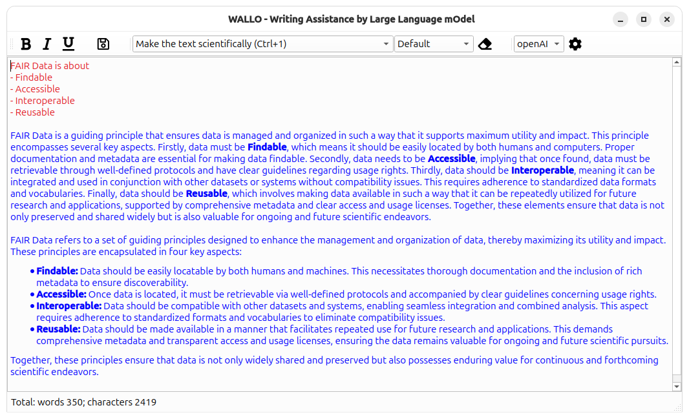

# WALLO - Writing Assistant leveraging Large Language mOdels

An intelligent writing partner that helps you craft clear, compelling manuscripts with ease while enhancing creativity.

## 1. Seamless Integration
Many writers rely on traditional text editors (e.g., Microsoft Word) while simultaneously using a Large Language Model (LLM) such as ChatGPT in a separate browser window—constantly copying and pasting between the two. This process is inefficient and disrupts creative flow. Programmers no longer work this way; their LLMs are fully integrated into their development environments.

**WALLO** brings the same seamless integration to writing by allowing users to directly "Make the text sound more professional.”, “Expand these bullet points into a cohesive paragraph.”, “Condense or expand this section to 200 words.” or “Summarize this PDF.”

## 2. Enhanced Ideation
Writers often turn to LLMs for brainstorming. While the process can be informative, they are often inconsistent. Productive ideas can get lost in long exchanges.
With **WALLO**, ideation and refinement happen in one software. You can highlight key insights within your conversation and filter out garbage.

## 3. Workflow
LLMs will change how 99% of users operate computers. **WALLo** allows users to test different workflows, user-interfaces-experiences-things. Hence, **WALLO** and its design will **evolve**, as certain things work, goals change, ... If you have ideas, open an issue and lets get into the discussion.

---


The writing of this program code and documentation are supported by LLMs (Antropic's Claude, openAI GPT-5-mini).


## Installation and usage
### Using pypi
```bash
  python -m venv .venv
  . .venv/bin/activate
  pip install wallo
```

### Github
```bash
  git clone git@github.com:SteffenBrinckmann/wallo.git
  cd wallo/
  python -m venv .venv
  . .venv/bin/activate
  pip install -r requirements.txt
```

### Usage
Usage:
```bash
  . .venv/bin/activate
  python -m wallo.main
```


## Configuration

Prompts, services and the other configuration settings are saved in .wallo.json file in your home folder.

## Development
### Things I might/might not add
- reduce does not fully work, debug

### Things I do not want to add
- pyInstaller to easily install on windows (only makes sense if finished program. Not the goal of this **Evolutionary Software**)
- Ensure long-running file operations and LLM calls surface progress and support cancellation. (Not the goal of this **Evolutionary Software**)
- Add timeout and retry/backoff logic for LLM API calls. (Not the goal of this **Evolutionary Software**)

### Upload to pypi
How to upload to pypi

1. Update version number in pyproject.toml
2. Execute commands
    ``` bash
      mypy wallo/
      pylint wallo/
      python3 -m build
      python3 -m twine upload dist/*
    ```

### Profiling
There has to be a python file to profile.
``` bash
  python -m cProfile -o profile.out wallo.py
  python -m pstats profile.out
    sort cumtime
    stats wallo.wallo
```
  ncalls  tottime  percall  cumtime  percall filename:lineno(function)
        1    0.000    0.000   29.916   29.916 /home/steffen/FZJ/SourceCode/wallo/wallo/main.py:1(<module>)
        1    0.000    0.000   29.795   29.795 /home/steffen/FZJ/SourceCode/wallo/wallo/ragIndexer.py:38(ingestPaths)
        1    0.000    0.000   25.638   25.638 /home/steffen/FZJ/SourceCode/wallo/wallo/llmProcessor.py:1(<module>)
        1    0.000    0.000   20.921   20.921 /home/steffen/FZJ/SourceCode/wallo/wallo/ragIndexer.py:90(_loadFile)
        1    0.000    0.000    6.738    6.738 /home/steffen/FZJ/SourceCode/wallo/wallo/worker.py:34(run)
        1    0.000    0.000    4.785    4.785 /home/steffen/FZJ/SourceCode/wallo/wallo/ragIndexer.py:1(<module>)
        4    0.000    0.000    2.828    0.707 /home/steffen/FZJ/SourceCode/wallo/wallo/exchange.py:167(audio1)
        1    0.000    0.000    2.761    2.761 /home/steffen/FZJ/SourceCode/wallo/wallo/llmProcessor.py:172(transcribeAudio)
        3    0.000    0.000    1.522    0.507 /home/steffen/FZJ/SourceCode/wallo/wallo/exchange.py:280(chatExchange)
        1    0.000    0.000    1.518    1.518 /home/steffen/FZJ/SourceCode/wallo/wallo/llmProcessor.py:71(processPrompt)
        1    0.000    0.000    1.401    1.401 /home/steffen/FZJ/SourceCode/wallo/wallo/ragIndexer.py:60(retrieve)
        1    0.000    0.000    0.949    0.949 /home/steffen/FZJ/SourceCode/wallo/wallo/exchange.py:1(<module>)
        1    0.000    0.000    0.926    0.926 /home/steffen/FZJ/SourceCode/wallo/wallo/misc.py:1(<module>)
        1    0.000    0.000    0.596    0.596 /home/steffen/FZJ/SourceCode/wallo/wallo/configManager.py:1(<module>)
        1    0.000    0.000    0.349    0.349 /home/steffen/FZJ/SourceCode/wallo/wallo/docxExport.py:1(<module>)
        1    0.000    0.000    0.258    0.258 /home/steffen/FZJ/SourceCode/wallo/wallo/main.py:181(addRagSources)
      2/1    0.003    0.002    0.234    0.234 /home/steffen/FZJ/SourceCode/wallo/wallo/main.py:22(__init__)
        1    0.000    0.000    0.221    0.221 /home/steffen/FZJ/SourceCode/wallo/wallo/pdfDocumentProcessor.py:1(<module>)
        2    0.003    0.002    0.203    0.101 /home/steffen/FZJ/SourceCode/wallo/wallo/exchange.py:30(__init__)
        1    0.000    0.000    0.201    0.201 /home/steffen/FZJ/SourceCode/wallo/wallo/configMain.py:1(<module>)
        1    0.000    0.000    0.192    0.192 /home/steffen/FZJ/SourceCode/wallo/wallo/configTabString.py:1(<module>)
       43    0.004    0.000    0.137    0.003 /home/steffen/FZJ/SourceCode/wallo/wallo/editorSpellCheck.py:37(highlightBlock)
        1    0.000    0.000    0.116    0.116 /home/steffen/FZJ/SourceCode/wallo/wallo/main.py:153(onWorkerFinished)
        2    0.000    0.000    0.116    0.058 /home/steffen/FZJ/SourceCode/wallo/wallo/exchange.py:359(setReply)
        1    0.000    0.000    0.114    0.114 /home/steffen/FZJ/SourceCode/wallo/wallo/llmProcessor.py:32(createClientFromConfig)
       35    0.002    0.000    0.087    0.002 /home/steffen/FZJ/SourceCode/wallo/wallo/editor.py:81(keyPressEvent)
